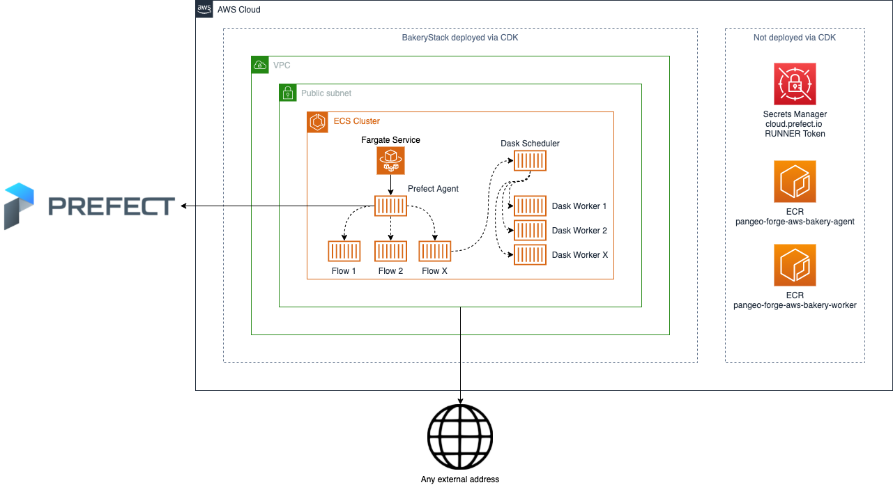

# pangeo-forge AWS Bakery ☁️🍞

This repository serves as the provider of an AWS CDK Application which deploys the necessary infrastructure to provide a `pangeo-forge` Bakery on AWS



# Contents

* [🧑‍💻 Development - Requirements](#requirements)
* [🧑‍💻 Development - Getting Started](#getting-started-🏃‍♀️)
* [🧑‍💻 Development - Makefile goodness](#makefile-goodness)
* [🚀 Deployment - Prerequisites](#prerequisites)
* [🚀 Deployment - Standard Deployments](#standard-deployments)

# Development

## Requirements

To develop on this project, you should have the following installed:

* Node 14 (We recommend using NVM [Node Version Manager](https://github.com/nvm-sh/nvm))
* [AWS CDK](https://docs.aws.amazon.com/cdk/latest/guide/getting_started.html) - There is a `package.json` in the repository, it's recommended to run `npm install` in the repository root and make use of `npx <command>` rather than globally installing AWS CDK
* Python 3.8.* (We recommend using [pyenv](https://github.com/pyenv/pyenv))
* [pipenv](https://github.com/pypa/pipenv)
* [AWS CLI](https://docs.aws.amazon.com/cli/latest/userguide/cli-chap-welcome.html)
* [Docker](https://docs.docker.com/get-docker/)

If you're developing on MacOS, all of the above (apart from AWS CDK) can be installed using [homebrew](https://brew.sh/)

If you're developing on Windows, we'd recommend using either [Git BASH](https://gitforwindows.org/) or [Windows Subsystem for Linux](https://docs.microsoft.com/en-us/windows/wsl/install-win10)

## Getting started 🏃‍♀️

To get setup for overall development, ensure you've installed all the above [requirements](#requirements). You can then run the following to install all development dependencies (NPM & Python):

```bash
$ make install-dev
```

If however, you're only deploying the repository as-is and not making code changes, you can only install the production required dependencies with:

```bash
$ make install
```

A file named `.env` is expected in the root of the repository, the expected values are:

```bash
OWNER="<your-name>"
IDENTIFIER="<a unique value to tie to your deployment>"
AWS_DEFAULT_REGION="<the AWS region you're deploying to>"
AWS_DEFAULT_PROFILE="<your named AWS CLI Profile to use for deployment>"
RUNNER_TOKEN_SECRET_ARN="<ARN of your Runner Token Secret>" # This is outlined in Deployment - Standard Deployments
PREFECT__CLOUD__AUTH_TOKEN="<A valid Prefect [Tenant token](https://docs.prefect.io/orchestration/concepts/tokens.html#tenant)> to support flow registration"
PREFECT_PROJECT="<An existing Prefect [Project](https://docs.prefect.io/orchestration/concepts/projects.html#creating-a-project) where the bakery's test flows will be registered>"
PREFECT_AGENT_LABELS="<A set of Prefect Agent [Labels](https://docs.prefect.io/orchestration/agents/overview.html#labels) which will be registered with the deployed agent to limit which flows should be executed by the agent>"
```

An example that you can modify and rename to `.env` is provided: `example.env`

## Makefile goodness

A `Makefile` is available in the root of the repository to abstract away commonly used commands for development:

**`make install`**

> This will run `npm install` and `pipenv install` on the repo root, installing only the dependencies needed for a production deployment

**`make install`**

> This will run `npm install` and `pipenv install --dev` on the repo root, installing the dependencies needed for development of this project

**`make lint`**

> This will perform a dry run of `flake8`, `isort`, and `black` and let you know what issues were found

**`make format`**

> This will peform a run of `isort` and `black`, this **will** modify files if issues were found

**`make diff`**

> This will run a `cdk diff` using the contents of your `.env` file

**`make deploy`**

> This will run a `cdk deploy` using the contents of your `.env` file. The deployment is auto-approved, so **make sure** you know what you're changing with your deployment first! (Best to run `make diff` to check!)

**`make destroy`**

> This will run a `cdk destroy` using the contents of your `.env` file. The destroy is auto-approved, so **make sure** you know what you're destroying first!

# Deployment

## Prerequisites

Firstly, ensure you've installed all the project requirements as described [here](#requirements) and [here](#getting-started-🏃‍♀️).

### cloud.prefect.io Runner Token

To successfully communicate with Prefect Cloud, the ECS Agent we deploy needs access to a `RUNNER` token [outlined here](https://docs.prefect.io/orchestration/agents/overview.html#tokens).

You should create a Secret in AWS Secrets Manager (in your deployment region) in the form:

```
{
    "RUNNER_TOKEN": "<The value of the token>"
}
```

Take a note of the ARN for the token and put it in your `.env` file under the key of `RUNNER_TOKEN_SECRET_ARN`.


## Standard Deployments

For standard deploys, you can check _what_ you'll be deploying by running:

```bash
$ make diff # Outputs the CDK Diff
```

To deploy the infrastructure, you can run:

```bash
$ make deploy # Deploys BakeryStack
```

To destroy the infrastructure, you can run:

```bash
$ make destroy # Destroys BakeryStack
```
